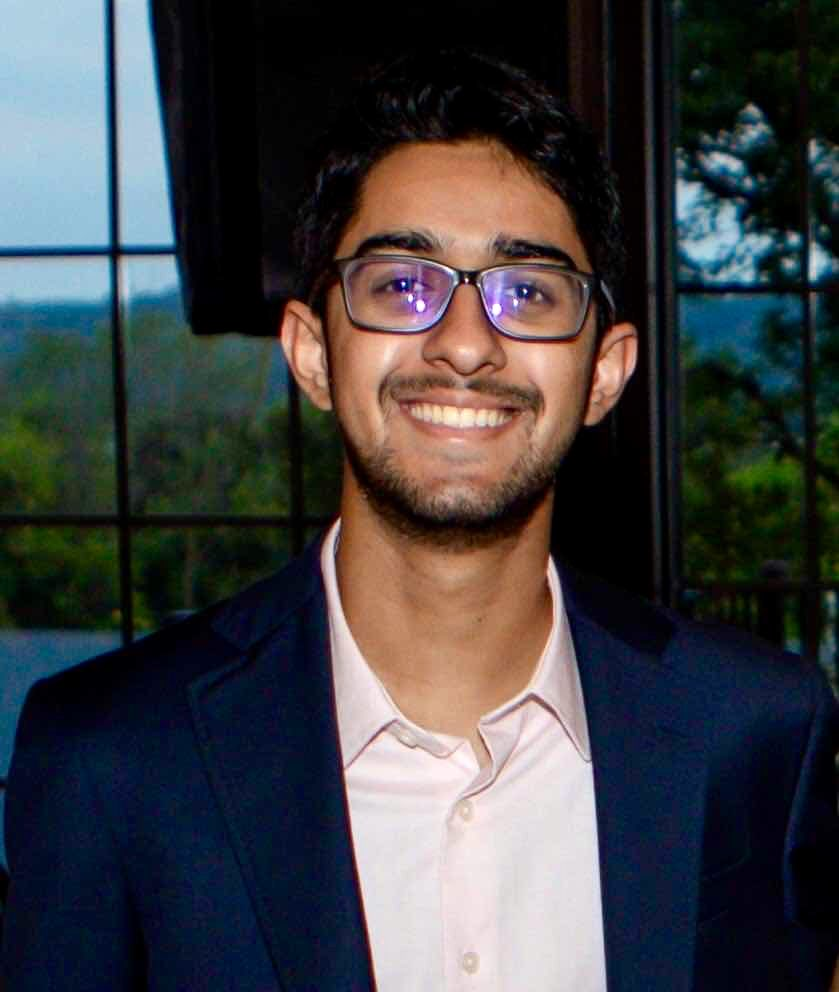

+++
+++

## Hi, I'm Arjun!

<!--  -->
I'm a 3rd year CS major at Georgia Tech concentrating in [Systems Architecture](https://www.cc.gatech.edu/academics/threads/systems-architecture) and [Theory](https://www.cc.gatech.edu/academics/threads/theory). I'm currently learning about quantum computing, compilers, PL theory, and computing systems!

You can contact me at `arjun.bhamra25@gmail.com`, and my Github is [@abhamra](https://github.com/abhamra)

---
### Work
I've spent most of my (limited) work life in the space of quantum compilers; in the summer of 2023, I worked @ [Quantinuum](https://www.quantinuum.com/), where I designed a domain specific language for Repeat-Until-Success circuits. The following summer, I worked @ [IBM](https://www.ibm.com/quantum) on rewriting their hardware Quantum Assembly compiler in [Rust](https://www.rust-lang.org/rust).

I also co-chair [dependently-typed](https://dtyped.netlify.app/), the compilers and programming languages club @ GT.

### Research
I work @ the [Center for Novel Computing Heirarchies (CRNCH)](https://crnch.gatech.edu/) in the TINKER Lab with Dr. Tom Conte and PhD student Austin Adams on quantum programming languages and compilers! Our paper, "ASDF: A Compiler for Qwerty, a Basis-Oriented Quantum Programming Language", has been accepted to CGO 2025!

A more complete resume can be found [here](/cv).

---
### What do I do?
I read somewhere recently that when asked about what someone does, the first answer is some sort of work related answer, and any hobby or passion is designated second-place. Perhaps that's because of how the question was phrased, but it's an interesting thought. Anywho, here are some things I find curious, interesting, fun, and the like :]
- Drumming
- Music, particularly Jazz and Funk, although I'll listen to basically anything that isn't country
    - [A favorite playlist](https://open.spotify.com/playlist/6Cb0nIeiLKU5iLzKOTE2V1?si=7de1db6e6d134ff3)
- Anime and animated shows (FMAB, TLOVM, A:TLA, Arcane, and Blue Eye Samurai are some standouts!)
- FPS Games (currently playing R6, The FINALS, Overwatch, and Deadlock)
- DND (we try not to minmax quite hard, here)
- Creative Writing (*work in progress*)
- My [dotfiles](https://github.com/abhamra/dotfiles) setup

### And now, a nice quote
> "Experience becoming [...] to make your soul grow"
> - Kurt Vonnegut
